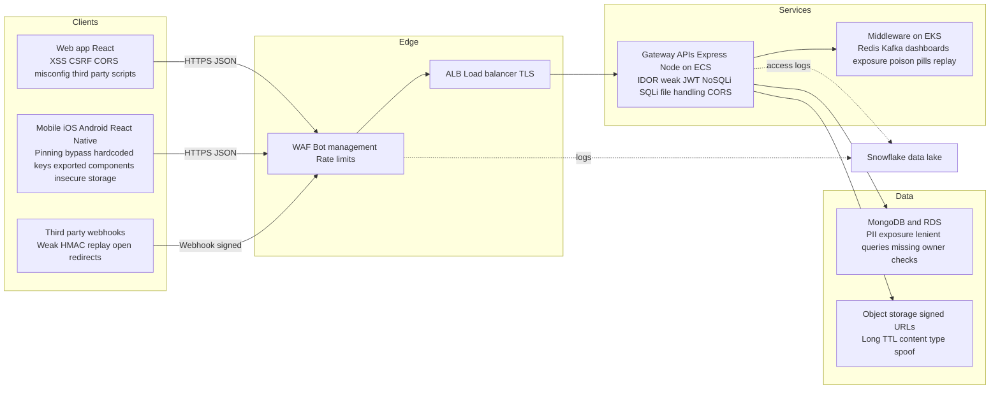
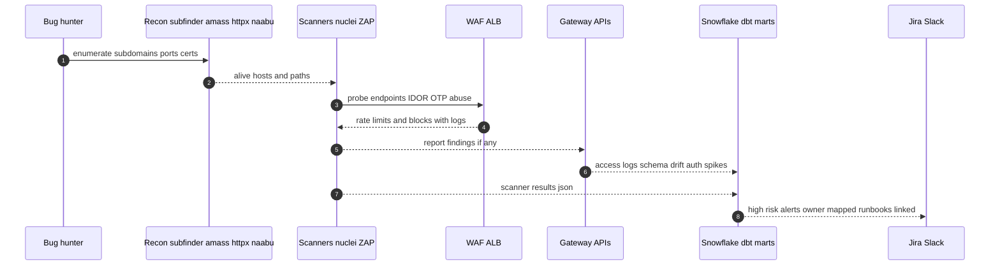
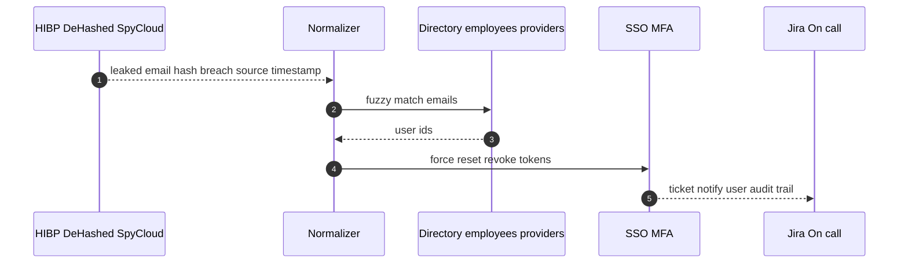

> *Context*: A VP of Platform Engineering asked, “How do we make our platform **IPO-ready**—fast, without fluff?”  
> This is the blueprint I’d implement for a stack with **React and React Native clients**, **Express on Node** APIs on **ECS** in private subnets, **EKS** hosting FOSS middleware, **MongoDB and RDS**, and **data pipelines on EMR, dbt, Snowflake**. Inter-service payloads are **JSON** via load balancer target groups, **no mesh**.

---

## TL;DR

- **Contract before code:** OpenAPI as truth, validate **requests and responses**, tag PII, enforce from gateway and service.
- **Least privilege by default:** CORS allowlist, strict headers, short-lived signed URLs, owner checks on every resource.
- **Find what hunters find—first:** FOSS-first pipeline for recon → scanners → mobile analysis → cloud posture → runtime → dark-web feeds → **Snowflake + dbt** → Jira/Slack.
- **Pre-IPO 7-day hardening:** freeze risky changes, WAF in block mode, secrets sweep and rotations, mobile pinning, top-20 IDOR pass, surge triage desk.

---

## 1) The Surface You’re Securing

- **Clients:** React web; Android in Java or Kotlin; iOS in Swift; React Native UI.
- **APIs:** Express on Node, JSON over HTTP; service discovery via LB target groups.
- **Runtime:** ECS in private subnets for APIs; EKS runs FOSS middleware for logging, monitoring, alerting, message queues, caches; a few standalone servers.
- **Data:** MongoDB and Amazon RDS.
- **Data Eng and Science:** EMR, dbt, Snowflake, Python jobs.
- **Inter-service:** JSON only, no gRPC or Avro.

---

## 2) Attack Map at a Glance



**What hunters probe first**

* **Web and APIs:** IDOR or BOLA, weak JWT validation, OTP and login abuse, NoSQLi on Mongo, SQLi on RDS, S3 signed URL misuse.
* **Mobile:** reverse-engineering to extract endpoints and flags, pinning bypass, exported component abuse.
* **Middleware:** exposed dashboards, unauth Redis or Kafka, replay and poison-pill messages.
* **Data:** over-broad responses, long-lived signed URLs, missing field projections.

---

## 3) Controls That Actually Move Risk

### Edge and gateway

* **WAF in block mode**, route-specific rate limits for login, OTP, reset; geo and ASN throttles.
* **CORS allowlist**, **HSTS**, **CSP with nonce**, **Referrer-Policy**, **Permissions-Policy**.
* **HMAC plus timestamp** on inbound webhooks, tight replay window, clock skew controls.

### APIs and authorization

* Central **owner check** for BOLA and IDOR; required in PRs and tests.
* JWT hygiene: verify **iss aud exp nbf**, rotate keys, pin JWKs, mTLS inside VPC.
* **Idempotency keys** for writes; reject replays.
* **Request and response validation** from OpenAPI; strip unknown fields by default.
* **File uploads:** size caps, MIME sniff plus allowlist, AV scan, **re-encode images**, signed URLs bound to content type and short TTL.

### Mobile

* **TLS pinning** with a rotation plan; no secrets in apps; secure keychain or keystore.
* Restrict **exported components** and URL handlers; safe WebView defaults.
* **Replay-safe OTP** and device velocity checks; proper logout and token revocation.

### Event-driven and middleware

* Redis or Kafka with **TLS and auth**, per-topic ACLs, **schema validation** even for JSON, dedupe keys, secured DLQs and retention.
* No public ingress to dashboards; SSO plus network ACLs; PII-safe logs and metrics.

### Data layer

* Response **field allowlists** and strict projections; deny additional fields.
* NoSQLi and SQLi hardening: safe builders, disallow Mongo operators like `$where` and `$regex` from user input.
* **Short TTL signed URLs**; bind to content type and size; single-use where possible.
* Encrypted backups, restore-tested; document the **crypto-shred** path for deletions.

### Cloud and EKS

* **IMDSv2** only; **IRSA** for pods; no static cloud keys in CI.
* Admission policies: no root, read-only filesystem, drop caps, seccomp, AppArmor.
* **Image signing and SBOMs**; block unscanned or unsigned images.
* **Egress allowlists** through NAT or proxy to limit exfil paths.

---

## 4) Automation: Beat the Hunters With Telemetry



**Collectors FOSS-first:** subfinder, amass, httpx, naabu, nuclei, OWASP ZAP headless, MobSF, gitleaks, trufflehog, Prowler, kube-bench, Falco, Trivy, Checkov.
**Paid where it helps:** Censys or Shodan for exposure, SpyCloud or Constella for breach matches, a CNAPP if already adopted.
**Normalize → Model:** land JSON to S3 → **Snowflake** → **dbt** marts: *Attack Surface*, *PII Drift*, *Leak Watch*, *Auth Abuse*.
**Triage:** auto-assign by service map, deduplicate, SLA timers, Slack and Jira with runbooks.

---

## 5) Secure Defaults You Can Drop In Today

**Express baseline**

```ts
// app.ts
app.use(securityHeaders({ cspNonce: true, hsts: true, referrer: 'strict-origin-when-cross-origin' }));
app.use(authn());                           // verify iss aud exp nbf, rotate keys
app.use(rateLimitPerRoute());               // tighter RPS for login, OTP, reset
app.use(validateRequestFromOpenAPI());      // ajv schemas for inputs
app.use(corsAllowlist());                   // strict origins and methods
app.use(idempotencyForWrites());            // reject replays with Idempotency-Key
app.use(piiRedactingLogger());              // structured logs without PII
// handlers...
app.use(validateResponseFromOpenAPI());     // block accidental over-exposure
```

**OpenAPI response allowlisting**

```yaml
components:
  schemas:
    UserProfile:
      type: object
      properties:
        id:
          type: string
          x-data-classification: internal_id
        email:
          type: string
          format: email
          x-data-classification: pii
      additionalProperties: false
```

**File uploads**
Size caps, MIME sniff plus allowlist, AV scan, **re-encode images**, short-TTL signed URLs bound to content type and hash.

**Queues and events**
Auth and TLS on Redis or Kafka, per-topic ACLs, **schema validation** for JSON, dedupe keys, DLQ ACLs and PII scrubbing.

---

## 6) Dark-Web and Credential Leak Auto-Reset



**Why it matters:** credential stuffing is cheap and fast. If an employee or privileged user reuses a breached password, you want the reset **before** anyone probes your perimeter.

---

## 7) Pre-IPO Seven-Day Hardening Plan

* **Day 0–1**: Freeze risky internet-facing changes. WAF to **block** for OWASP rules. Tight rate limits on login, OTP, reset. Enable **HSTS** and strict **CSP**. Review CORS.
* **Day 1–2**: Exposure sweep with Censys or Shodan plus security group audits. Close **all dashboards** from the internet. S3 public audit. Verify Redis and Kafka **TLS and auth**.
* **Day 2–3**: Org-wide secret scans and rotations. Revoke unused OAuth apps. Enforce **MFA** everywhere.
* **Day 3–4**: Mobile pass—MobSF clean, pinning verified, release flags only, remove debug toggles.
* **Day 4–5**: **IDOR pass** on top 20 endpoints for bookings, payments, addresses, profiles. Add missing owner checks and tests.
* **Day 5–6**: Bug-bounty **surge desk**: on-call rota, pre-approved hotfix playbook, comms templates, takedown decision tree.
* **Day 6–7**: Red-team smoke tests. Final dashboards. Exec readout: risk register with owners and dates.

---

## 8) PR Template and SLAs

**PR checklist for internet-facing changes**

* [ ] AuthZ explicit and tested with owner checks
* [ ] Per-route rate limit and idempotency where relevant
* [ ] Request **and response** validated against OpenAPI
* [ ] No secrets in code or logs
* [ ] PII fields reviewed and masked where needed
* [ ] File handling safe: MIME, size, AV, re-encode
* [ ] No new public ingress or dashboards

**SLAs:** Critical 24h • High 3d • Medium 7d. Every alert links to a **runbook** with reproduction and safe rollback.

---

## 9) What We Track

* **External exposure:** new open ports or domains versus baseline → page on call if critical.
* **PII drift:** responses returning fields **not** in the spec.
* **Auth abuse:** login or OTP failure spikes by IP and ASN; geo anomalies.
* **Leak watch:** new employee matches in breach feeds and reset status.
* **Mobile risk:** top MobSF issues by app version.

---

## Closing

IPO-ready security is not a tooling contest. It is **good defaults** plus **honest telemetry**: contracts that prevent over-sharing, controls that limit blast radius, and a pipeline that shows drift the moment it appears. Ship that, and you stay ahead of hunters—and your engineers keep shipping with confidence.

