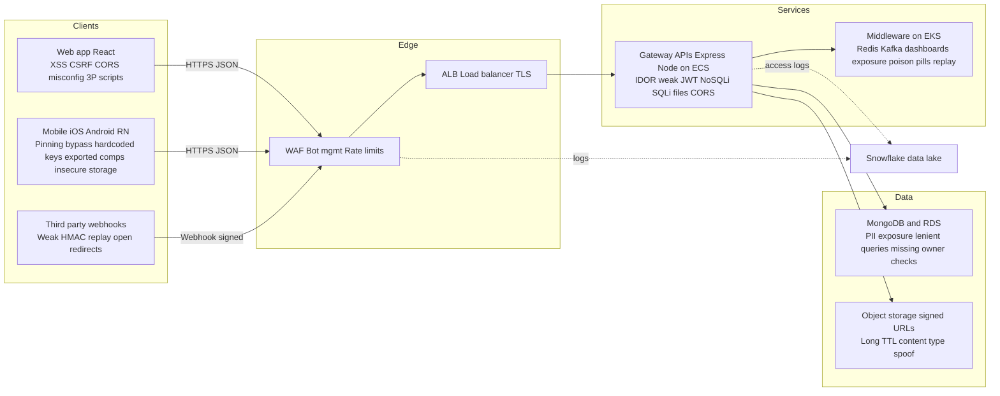
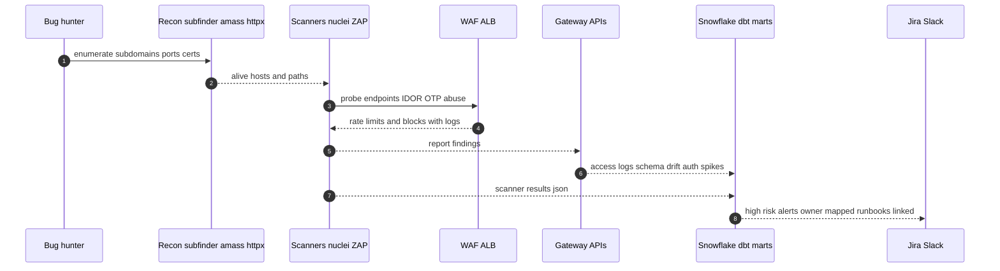
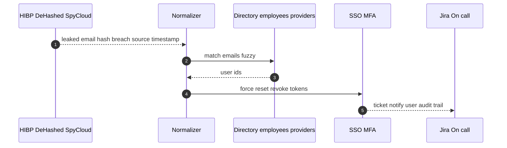

---

title: "IPO-Ready Security: A Practical Playbook for VPs of Platform Engineering"
date: 2025-09-06
tags: \[security, platform, devsecops, IPO, cloud, mobile]
summary: A concise, technically detailed strategy to harden web, mobile, APIs, and cloud—built for a soon-to-IPO company with Node on ECS, middleware on EKS, MongoDB and RDS, React and React Native clients.
---

> *Context:* A VP of Platform Engineering asked, “What does **IPO-ready security** look like, end-to-end?”
> This post is my practical answer—what I’d recommend and implement, distilled from prior hands-on experience in a very similar stack.

---

## TL;DR

**Make the secure path the default** and wire a **FOSS-first automation pipeline** that finds what bug hunters would—**before** they do.

1. **Edge & Contracts**: WAF in block mode, strict CORS, CSP, rate limits, OpenAPI as security contract with request **and response** validation.
2. **AuthZ & IDOR**: Central, testable **owner checks** on every resource access. JWT hygiene. Idempotency for all writes.
3. **Mobile hygiene**: TLS pinning, no secrets in apps, secure storage, release-only flags, webview guardrails.
4. **Cloud & Runtime**: IMDSv2, least-privilege IAM, admission policies, signed images, Falco runtime, egress allowlists.
5. **Leak watch**: Continuous breach monitoring for employee creds with **auto-reset** and token revocation.
6. **Automation**: Recon → scanners → mobile analysis → cloud posture → runtime → dark-web feeds → **Snowflake + dbt** → Jira/Slack with runbooks.
7. **7-Day Hardening**: A short, aggressive checklist to stabilize public surfaces pre-IPO.

---

## 1) The Stack We’re Securing

* **Clients**: Web app in React; Mobile apps for Android (Java or Kotlin), iOS (Swift), plus React Native.
* **APIs**: Express on Node, JSON over HTTP, service discovery via LB target groups, no mesh.
* **Runtime**: Node microservices on **ECS in private subnets**; **EKS** runs FOSS middleware (logging, monitoring, alerting, message queues, caching). A few standalone servers exist.
* **Data**: MongoDB and Amazon RDS.
* **Data Eng/Science**: EMR, dbt, Snowflake, Python workloads.
* **Inter-service**: JSON payloads only (no gRPC or Avro).

---

## 2) Design Principles

* **Contract before code**: OpenAPI as the source of truth, with **req+resp validation** and PII tagging.
* **Deny by default**: Tight CORS, strict headers, field-level response allowlists, short-lived signed URLs.
* **Shift-left + log-right**: Lint/spec diffs, secrets scans, IaC checks in CI; rich logs and metrics into Snowflake for correlation.
* **Evidence-driven**: Dashboards for exposure, PII drift, auth abuse, and leak watch; SLAs and runbooks wired to alerts.
* **FOSS-first**: Use battle-tested open source where possible; layer paid tools only where they give time-to-value.

---

## 3) Attack Surface At A Glance



---

## 4) How Hunters Try To Break You (and How We Block It)

**Web & APIs**

* **BOLA/IDOR**: attacker fetches a different user’s resource using guessed IDs.

  * *Block*: central `ownerCheck(subject, resourceOwner)` helper enforced in PRs + tests.
* **Auth flaws**: weak JWT checks or refresh flows.

  * *Block*: verify `iss`, `aud`, `exp`, `nbf`, rotate signing keys, pin JWKs, mTLS inside VPC.
* **Abuse**: OTP brute-force, password reset abuse, credential stuffing.

  * *Block*: route-specific rate limits, IP and ASN throttles, device velocity rules, breach-password checks.
* **Input vulns**: NoSQLi in Mongo (`$where`, `$regex`), SQLi in RDS, prototype pollution.

  * *Block*: safe query builders, deny Mongo operators in user input, schema validation for req+resp.

**Mobile**

* Reverse engineering to extract endpoints, feature flags, secrets.

  * *Block*: **no secrets in apps**, TLS pinning, secure keystore/keychain, restrict exported components and URL handlers.

**Infra & Middleware**

* Exposed dashboards, unauth Redis or Kafka, replay and poison-pill messages.

  * *Block*: SSO plus network ACLs, TLS and auth on brokers, per-topic ACLs, schema validation even for JSON, DLQ ACLs.

**Data**

* Over-broad responses, long-lived signed URLs, missing field projections.

  * *Block*: allowlisted response fields, short-TTL signed URLs bound to content type and size, AV scan and re-encode uploads.

---

## 5) The Automation Pipeline

**Goal:** discover what external hunters would—**first**—and turn it into tickets and dashboards.



**Collectors (FOSS-first):** subfinder, amass, httpx, naabu, nuclei, ZAP headless, MobSF, gitleaks, trufflehog, Prowler, kube-bench, Falco, Trivy, Checkov.
**Paid where it helps:** Censys or Shodan, SpyCloud or Constella, a cloud CNAPP if you already run one.
**Store & Model:** land JSON into S3 → **Snowflake** → **dbt** marts: *Attack Surface*, *PII Drift*, *Leak Watch*, *Auth Abuse*.
**Triage:** auto-assign to owning squad (service→LB→ECS task), dedup, SLA timers, Slack + Jira.

---

## 6) Secure Defaults You Can Drop In

**Express middleware baseline**

```ts
// app.ts
app.use(securityHeaders({ cspNonce: true, hsts: true, referrer: 'strict-origin-when-cross-origin' }));
app.use(authn());                           // verify JWT iss aud exp nbf
app.use(rateLimitPerRoute());               // sensitive routes get tighter RPS
app.use(validateRequestFromOpenAPI());      // ajv with schemas
app.use(corsAllowlist());                   // strict origins and methods
app.use(idempotencyForWrites());            // reject replays
app.use(piiRedactingLogger());              // no secrets or PII in logs
// handlers...
app.use(validateResponseFromOpenAPI());     // block accidental over-exposure
```

**Response allowlisting**

```json
{
  "components": {
    "schemas": {
      "UserProfile": {
        "type": "object",
        "properties": {
          "id":   { "type": "string", "x-data-classification": "internal_id" },
          "email":{ "type": "string", "format": "email", "x-data-classification": "pii" }
        },
        "additionalProperties": false
      }
    }
  }
}
```

**File uploads**

* Size caps, MIME sniff + allowlist, AV scan, **re-encode images**, signed URLs with TTL under 5 minutes and content-type binding.

**Queues and events**

* Auth + TLS on Redis or Kafka, per-topic ACLs, **schema validation** for JSON events, dedupe keys, DLQ ACLs and PII scrubbing.

**Kubernetes and cloud**

* IMDSv2 only, IRSA for pods, admission policies (no root, read-only FS, drop caps), signed images (cosign), block unscanned images, egress allowlists.

---

## 7) Dark-Web and Credential Leak Auto-Reset



**Why it matters:** Hunters love credential stuffing. If an employee or privileged user reuses a breached password, you want the reset **before** they probe you.

---

## 8) Pre-IPO Seven-Day Hardening Plan

* **Day 0–1**: Freeze risky internet-facing changes. WAF to **block** for OWASP rules. Tight rate limits on login, OTP, reset. Enable **HSTS** and a strict **CSP**. Review CORS.
* **Day 1–2**: Exposure sweep with Censys or Shodan plus SG audits. Close **all dashboards** from the internet. S3 public audit. Verify Redis and Kafka **TLS + auth**.
* **Day 2–3**: Org-wide secret scans and rotations. Revoke unused OAuth apps. Enforce **MFA** across the org.
* **Day 3–4**: Mobile pass—MobSF clean, pinning verified, release flags only, remove debug toggles.
* **Day 4–5**: **IDOR pass** on top 20 endpoints for bookings, payments, addresses, profiles. Add missing owner checks.
* **Day 5–6**: Bug-bounty **surge desk**: on-call rota, pre-approved hotfix playbook, comms templates, takedown decision tree.
* **Day 6–7**: Red-team smoke tests. Lock dashboards. Exec readout: risk register with owner and dates.

---

## 9) What We Track (Metrics and Alerts)

* **External exposure**: new open ports or domains compared to baseline—**page on call** if critical.
* **PII drift**: responses returning fields **not** in the spec.
* **Auth abuse**: login or OTP failure spikes by IP and ASN; geo anomalies.
* **Leak watch**: new employee matches in breach feeds and reset status.
* **Mobile risk**: top MobSF issues by app version and market rollout.

---

## 10) Team Workflow: PR Template and SLAs

**PR checklist for internet-facing changes**

* [ ] AuthZ explicit and tested (owner checks)
* [ ] Per-route rate limit and idempotency where relevant
* [ ] Request **and response** validated against OpenAPI
* [ ] No secrets in code or logs
* [ ] PII fields reviewed and masked where needed
* [ ] File handling safe (MIME, size, AV, re-encode)
* [ ] No new public ingress or dashboards

**SLAs**: Critical 24h • High 3d • Medium 7d. Every alert links to a **runbook** with reproduction and a safe rollback.

---

## 11) Governance, Legal, and Ethics

* Respect robots and TOS where applicable; do not purchase stolen data.
* Store **only the necessary** breach indicators (e.g., hashed emails).
* Keep raw leak artifacts in restricted buckets; document processing in a Record of Processing.

---

## Closing

IPO-ready security is **not** a tooling contest—it’s **good defaults** plus **honest telemetry**.
If the platform makes secure the easiest way to ship, and your pipeline **catches drift** the moment it appears, you’ll be calmer than the hunters on the outside.

*Opinions are my own. Diagrams and checklists here are free to reuse under CC BY 4.0.*
